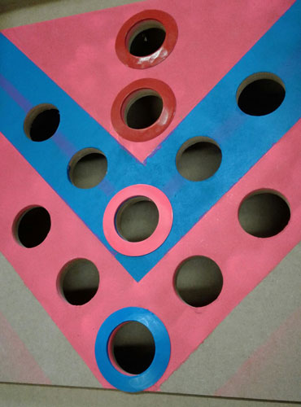

# Camel race

User interface animation   |  Client play illustration
:-------------------------:|:-------------------------:
  |  

# The system

- Raspberry PI 3
- Websocket server that captures all gpio events and emits these to the client (python)
- Web browser with websocket client (js) that shows the web interface 
- Server is connected to 5 player set-ups that consist of 5x break beam sensor to detect falling balls:

https://www.adafruit.com/product/2167

Holes 1             |  Holes2
:------------------:|:---------------------:
  |  
